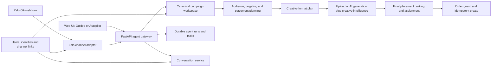
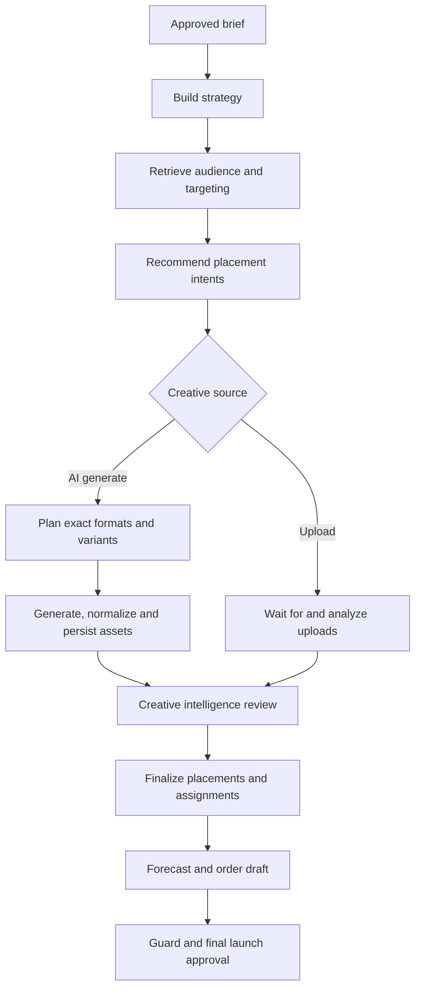

# Advertising Agent — Final Enhancement Phase Roadmap

Date: 2026-07-18

Status: in progress; FE-1 implementation, FE-2B, Zalo Login/OA linking, the FE-3 durable channel worker and the FE-4 narrow campaign-operation slice are deployed. Zalo natural-language planning now uses a bounded, structured `gpt-5.4-mini` Responses API layer while server-owned resolvers and workflows retain authority. Final campaign-bearing Zalo acceptance, FE-0 closeout and FE-5 release-candidate rehearsal remain open.

Scope: finish the current campaign agent, add placement-aware creative generation, then add identity, conversation history, and Zalo OA as a first-class channel.

## 1. Product outcome

The final enhancement phase turns Advertising Agent from a strong local campaign demo into a multi-channel campaign assistant with two consistent experiences:

- **Guided Workflow:** the operator moves through the campaign workspace with a chat Copilot. The flow remains easy to inspect and correct.
- **Campaign Autopilot:** the operator provides a brief, selects an approval policy and creative source, then the agent builds an order-ready campaign while pausing at required review boundaries.
- **Zalo OA channel:** new campaigns use the existing Campaign Autopilot graph through a text/image adapter. Existing campaigns support owned list/select/status/setup/report/live view plus confirmed pause/resume. Zalo does not get a Guided state machine, a prompt-only campaign agent or a second campaign database.

The web application remains the richest workspace. Zalo is a conversational control surface for starting Autopilot work, approving existing run reviews, checking status/setup/report/live view, confirming pause/resume, and receiving eligible progress updates. All other campaign edits deep-link to the web workspace.

## 2. Decisions made for this phase

| Item | Decision |
|---|---|
| Golden set | The independent review is accepted by the human owner. Apply its proposed edits, preserve catalog-gap notes, validate, and mark each case `approved` or `edited`; do not mark the unedited files approved. |
| 128-scenario suite | The suite and report contract exist, but all 128 scenarios have **not** been executed end to end. Existing unit/API/evaluator evidence is not equivalent to the full browser suite. |
| Manual creative journeys | The operator will manually test one upload journey and one real AI-generation journey against the healthy local stack. |
| Provider/restart drills | Downgraded from a broad product milestone to two small release checks around irreversible or paid side effects: generated-image retry and order-creation retry. Exhaustive chaos testing is deferred. |
| Multi-format generation | Highest-priority product feature. Add placement intent before AI generation, then finalize placements after creative analysis. |
| Qwen reranker | Leave configured but disabled; no A/B work in this phase. |
| Analytics/report agent | The current Copilot analytical report module is now shared with Autopilot, including six generated report views and cached report Q&A. A future live-delivery optimization/anomaly agent remains low priority and out of scope. |
| Identity | Anonymous-first. Zalo is the primary login provider; local email/password remains a temporary testing/rollback provider on the same user model. Google login is not planned. |
| Zalo integration | Reuse the proven adapter pattern from `them-ga-ran`: signature-verified webhook, immediate acknowledgement, durable background processing, persisted rotating OA tokens, channel identity mapping, and isolated message rendering. |

## 3. Current baseline

The local Compose stack currently provides:

- React/Vite frontend at `http://localhost:5175`.
- FastAPI agent at `http://localhost:8080`.
- Node campaign backend at `http://localhost:3000`.
- MongoDB, Qdrant, Prometheus, Grafana, LangGraph workspaces/runs and creative workers.
- Guided and Autopilot modes, workspace proposals, non-linear invalidation, audience RAG, creative intelligence, order guard and idempotent order creation.
- Placement-aware AI creative generation with exact-size deduplication, a three-asset cap and persisted generation provenance.
- Completed Autopilot runs expose Result, Setup report and Analytical report tabs. Result/setup use real workspace artifacts; the shared report module generates clearly labelled synthetic showcase delivery data, six analytical views and cached report Q&A from the verified campaign setup.

The local readiness endpoint reports MongoDB, backend, RAG index/runtime, creative worker and Autopilot worker ready. This is a good development baseline, not proof that the complete user journey is defect-free.

## 4. Target architecture



Core rule: the channel changes how messages are received and rendered, not how campaign state, approvals, safety checks or side effects work.

## 5. FE-0 — Truth closeout and test baseline

### 5.1 Apply the golden-label decision

The golden set is fixed, labeled evaluation data for audience retrieval. Each case contains a realistic campaign brief and expected audience behavior:

- `must_include`: segments a good retriever should return.
- `acceptable`: relevant alternatives that are allowed but not mandatory.
- `must_exclude`: clearly wrong or explicitly excluded segments that must never be recommended.
- targeting expectations: values the targeting pipeline should or must not set.

It exists to measure retrieval recall, exclusion safety, catalog grounding and regressions between retrieval versions. It is not production training data and it is not a list the agent should memorize.

Required closeout:

1. Apply the machine-readable proposed changes from the 041–080 audit.
2. Keep the six `CATALOG_GAP` cases usable where possible, but document the missing taxonomy instead of inventing labels.
3. Mark unchanged pass cases `approved`; mark corrected cases `edited` with reviewer, timestamp and comment.
4. Run `python eval/golden_set/validate.py` and `python eval/golden_set/check_v2_review.py`.
5. Rerun the audience safety evaluator and require zero exclusion and unknown-ID violations.

### 5.2 Be precise about the 128 scenarios

The repository contains a 128-scenario manifest, executor prompt and structured report schema. It is a comprehensive test specification, not a statement that all scenarios passed.

Execution policy for this phase:

- Run focused unit/API/evaluator tests on every feature slice.
- Run browser scenarios that touch the changed journey before merging that slice.
- Run the complete 128-scenario suite only after FE-1 and FE-2 stabilize, then again before the hackathon release candidate.
- Preserve `pass`, `fail`, `blocked`, and `not_run` separately. Never convert missing browser runtime into a pass.

### 5.3 Minimal recovery checks

Broad provider chaos testing is deferred. Keep only two high-value checks:

- Retry/restart after an AI image was generated or uploaded: the idempotency key must reuse the asset and avoid a second paid generation.
- Retry/restart around launch approval: the same approval/idempotency key must create exactly one order.

These checks protect money and irreversible state. Other timeout combinations can remain in the comprehensive suite backlog.

Exit criteria:

- Golden review checker passes with human-owned statuses.
- Audience safety evaluator has zero explicit-exclusion violations.
- Current deterministic tests remain green.
- The two side-effect recovery checks pass.

## 6. FE-1 — Placement-aware multi-format creative generation

This is the first implementation milestone.

Implementation status (2026-07-16): code-complete and deterministic-test green. The capability graph now contains `plan_placement_intent` and `plan_creative_formats`; generated assets are capped, dimension-deduplicated, concurrent and revision-idempotent; final placement runs after creative verdicts. Completed runs now normalize those artifacts into the shared Guided Result surface plus a dedicated setup report, while pending orders are never labeled live. Verification after the outcome enhancement: 27 frontend tests and a production frontend build; the existing backend capability tests remain green from the FE-1 slice. FE-1 remains open until one real upload journey and one real provider-backed multi-format generation journey pass locally.

### 6.1 Problem and approach

The current workflow creates or uploads creative before final ad-zone selection. One fixed 300×250 AI asset cannot cover zones with different dimensions and aspect ratios. Moving the whole zone step before creative would make Guided Workflow less natural and would still leave uploaded assets needing compatibility analysis.

Use a two-pass placement design:

1. **Placement intent:** rank candidate zones from brief, objective, audience, budget, dates and inventory without requiring a finished creative.
2. **Creative format plan:** derive the smallest useful set of exact formats from those candidates.
3. **Creative preparation:** upload existing assets or generate requested formats.
4. **Creative intelligence:** measure actual dimensions, OCR, safety and quality.
5. **Final placement:** rerank/filter candidates using approved creative files and assign an exact file to each selected zone.

### 6.2 Capability graph



### 6.3 Data contracts

Add a `placement_intent` artifact containing workspace revision, catalog-valid candidate zone IDs, per-zone score/reasons, inventory check time and expiry.

Add a `creative_format_plan` artifact containing source mode, brief/placement revisions, exact width/height/media type, intended zone IDs, variant count, required/optional status, maximum assets and estimated provider calls.

Each generated asset must preserve:

- run ID, brief revision and format-plan revision;
- exact width/height and intended zone IDs;
- prompt template version and prompt fingerprint;
- provider/model and generation provenance;
- idempotency key: `run + format_key + variant + format_plan_revision + brief_revision`;
- deterministic and VLM verdict IDs.

### 6.4 Generation policy

- Generate exact placement families, not one master image stretched to every ratio.
- Deduplicate zones that accept the same exact dimensions.
- Default to one variant per required format and a maximum of three generated assets per run. Expose the cap as configuration.
- Preserve semantic copy and brand intent while adapting composition and safe areas for each ratio.
- Do not generate unsupported formats or infer dimensions not present in the server zone catalog.
- Parallelize independent formats with bounded worker concurrency.
- A partial provider failure keeps successful formats and retries only missing formats.
- Never silently replace an approved upload with an AI asset.

### 6.5 Guided versus Autopilot behavior

Guided Workflow keeps the visible Brief → Audience → Creative → Setup order:

- Upload path: analyze uploaded files, then Setup shows only compatible/recommended zones.
- AI path: compute a preliminary placement intent in the background, show the planned formats for confirmation, generate them, then Setup performs final zone selection.

Autopilot performs placement intent automatically after audience/targeting. Its approval policy may auto-approve the format plan and generated assets only when safety/quality rules pass. Final campaign launch still requires explicit approval.

### 6.6 FE-1 acceptance tests

- One brief whose top zones require at least two dimensions produces both exact formats.
- Two zones sharing a dimension produce one reusable asset, not duplicate generations.
- Changed objective/budget/date invalidates placement intent and downstream format plan.
- Changed brand/message invalidates generated assets and downstream assignment.
- A failed second format preserves the successful first format and resumes only missing work.
- Retry after persisted upload causes no duplicate provider charge or backend file.
- Final placement contains only catalog-valid zones and compatible approved assets.
- VLM/manual-review and final-launch gates remain intact.

### 6.7 Completed-run outcome contract

After `create_setup_report` succeeds, Autopilot exposes three operator-facing tabs:

1. **Kết quả:** reuses the Guided campaign result surface, including placements, creative mappings, forecast and local preview links.
2. **Báo cáo setup:** renders brief, selected strategy, audience, targeting, placements, creative assignments, forecast, guard and order state from canonical workspace artifacts.
3. **Báo cáo phân tích:** reuses the same full `ReportStep` as Campaign Copilot. Once the verified order is active, the backend generates clearly labelled synthetic showcase delivery records and six cached analyses (`daily_ops`, `awareness`, `consideration`, `conversion`, `retention`, `executive`). The user can inspect KPI cards/charts, switch report type and ask report questions in chat; Autopilot terminal chat yields report questions to the shared report handler while other post-run questions remain artifact-grounded.

Report generation is idempotent. A generation lease prevents duplicate provider work and duplicate analytics records, retry clears terminal error rows, and a stale lease can be reclaimed after a backend restart. The synthetic data is a hackathon demonstration contract, not live delivery truth; a future provider-backed analytics pipeline can replace the data source without creating a second UI/report conversation model.

The shared adapter converts Autopilot's numeric creative indices into stable creative IDs and unwraps verified order artifacts. When an order artifact exists, `order.status` is authoritative for live delivery; campaign dates alone must never turn a pending order into a live result. An Autopilot order is created as `active` only after the explicit final launch approval and successful order verification.

### 6.8 Strict-review edit and resume contract

`review_every_stage` now reviews decisions and artifacts, not mechanical duplicate confirmations. A valid brief is checked automatically because it was already explicitly approved before Autopilot starts; invalid or expired briefs still stop with a repair action.

Every review boundary renders its actual pending output in a dedicated **Nội dung cần review** panel:

- strategy options are selectable only while the run is stopped at a review;
- audience shows full catalog size, query-specific RAG candidate count, selected segments and reasons;
- targeting shows every catalog-validated dimension and value;
- placement intent shows the preliminary zone shortlist before creative filtering;
- format planning shows exact dimensions, covered placements and unsupported/cost-capped zones;
- creative upload shows required formats and exact-pixel coverage before analysis;
- final placements, assignments, forecast, guard and launch expose their decision inputs.

Opening an editor no longer submits a rejection. The run stays `waiting_review`. When the operator saves Audience, Targeting or Creative, the canonical mutation supersedes the pending proposal for that same artifact, marks the reviewed producer task succeeded with a `workspace_override` decision, and replans only downstream consumers. A separate confirmed **Hủy run** action is the only destructive exit from the review card.

The upload editor receives the approved `creative_format_plan`, displays every required size, uploads durable files, runs deterministic/VLM analysis, commits the creative artifact and returns to the same Autopilot run after a successful save. The input gate rechecks coverage after every upload. Full coverage continues; partial coverage pauses with the missing sizes and lets the operator upload more or explicitly accept a smaller compatible placement subset. Final placement remains fail-closed: only exact-size or explicitly approved skin matches can reach launch.

Verification on 2026-07-17: 219 backend tests, 35 frontend tests, production frontend build, healthy local Compose services, and an in-app browser check proving that **Tải creative lên** opens the Creative workspace with all three required formats while the existing run remains in `waiting_review`.

## 7. FE-2 — Accounts, anonymous use and conversation history

Implementation status (2026-07-17): the anonymous foundation and FE-2B local-account slice are code-complete and locally verified. The Agent service now supports Argon2id local registration/login, opaque hashed revocable HttpOnly account sessions, centralized CSRF protection, one server-side account/anonymous actor resolver, explicit atomic device-conversation claim, account history and cross-device resume. Login never claims automatically. Anonymous use remains available, and existing pre-FE-2 evaluator sessions remain migration-compatible. Detailed evidence is in `22-fe2b-local-accounts-evidence.md`.

Permanent deletion is intentionally distinct from archive. A user may delete one conversation after confirming its campaign name, or delete all active and archived conversations only after typing `XÓA TẤT CẢ`. Deletion removes the transcript, canonical workspace, proposals, creative jobs, Autopilot runs/events/tasks and graph checkpoints for the owned session. AdsPilot campaign orders remain business records. A conversation with a non-terminal Autopilot run cannot be deleted until that run is stopped or reaches a terminal state.

Local verification after FE-2B: 242 backend tests, 58 frontend tests, production frontend build, live additive-index inspection and two independent cookie-jar browser journeys covering anonymous creation, explicit claim, old-device denial, cross-device account resume, foreign-account isolation and anonymous use after logout.

Zalo Login and explicit Zalo identity attachment were deployed on 2026-07-18. The flow uses Social OAuth v4 PKCE, one-time Mongo TTL attempts bound to the current browser/account session, provider identity `(zalo, profile.id)`, and the same opaque FE-2B account cookie. Zalo access tokens are request-local only. Login never claims anonymous conversations. Local auth remains visible only as a testing fallback; Google login is no longer planned. The verified production domain, callback and signed OA link flow are documented in `23-zalo-login-oa-link-foundation-evidence.md`.

Completed execution slice (2026-07-17): **FE-2B local accounts, secure account sessions, explicit anonymous-conversation claim and cross-device resume**. The implementation contract and rollback boundary remain in `20-fe2b-local-accounts-handoff.md`; completion evidence is in `22-fe2b-local-accounts-evidence.md`.

### 7.1 Experience rules

- A visitor may start immediately as an anonymous user.
- Anonymous conversations persist on that device with a server-issued anonymous identity.
- Login is offered for cross-device history, Zalo synchronization and future account-level campaign operations; it is not required to try the product.
- After login, the user sees conversation history and can resume the exact canonical workspace/run.
- Logging in during an anonymous conversation offers to attach that conversation to the account.

### 7.2 Identity model

Use one internal `user_id` with multiple provider identities:

```text
users
  _id, display_name, status, created_at, last_seen_at

auth_identities
  user_id, provider(local|zalo), provider_subject,
  verified_email_or_phone, password_hash?, created_at

anonymous_identities
  anonymous_id, device_token_hash, claimed_by_user_id?, expires_at

conversations
  _id, owner_user_id?, anonymous_id?, workspace_id, title,
  experience_mode, last_message_at, archived_at

channel_identities
  user_id?, channel(zalo_oa), oa_id, external_uid,
  status(pending|linked|revoked), linked_at
```

A Zalo Login identity and a Zalo OA-scoped UID are separate external identities. Link them to the same internal user through a short-lived, one-time linking transaction; do not assume the identifiers are interchangeable. The preferred UX is an OA follow widget, but its browser callback is not identity proof: only a signed `follow` webhook whose `user_id_by_app` matches the authenticated Zalo Login identity may consume that account's explicit pending link attempt. A signed one-time `LINK` message remains the fallback for users who already follow the OA.

### 7.3 Authentication sequence

Recommended delivery order:

1. Anonymous identity plus conversation list/resume.
2. Local username/email and password using Argon2id, verification and reset flow.
3. Zalo Login using the existing account session authority.
4. Zalo OA channel-link flow.

Use secure, HTTP-only, SameSite cookies for web sessions. Do not put long-lived access tokens in local storage. Add CSRF protection for cookie-authenticated mutations, session revocation, login rate limits and an audit record for account/channel linking.

### 7.4 APIs

The anonymous foundation is currently mounted behind the existing Agent BFF as
`/api/agent/auth/anonymous` and `/api/agent/conversations...`. The account
endpoints below remain the target public contract for the login slices; route
normalization can happen when the account session layer is introduced.

```text
POST /api/auth/anonymous
POST /api/auth/register
POST /api/auth/login
POST /api/auth/logout
GET  /api/auth/me
POST /api/agent/auth/zalo/start
GET  /api/agent/auth/zalo/callback

GET  /api/conversations
POST /api/conversations
GET  /api/conversations/:id
POST /api/conversations/:id/claim
POST /api/conversations/:id/archive
DELETE /api/conversations/:id
DELETE /api/conversations   # body confirmation=DELETE_ALL

POST   /api/agent/channel-links/zalo
GET    /api/agent/channel-links/zalo/:attempt_id
DELETE /api/agent/channel-links/zalo
```

Every workspace, run, proposal and order operation must resolve the actor server-side. A browser-provided `user_id`, `workspace_id` or conversation owner is never trusted by itself.

### 7.5 FE-2 acceptance tests

- Anonymous Guided and Autopilot journeys still work.
- Browser refresh resumes the same anonymous conversation and workspace.
- Login from another browser lists and resumes account-owned conversations.
- Claiming an anonymous conversation preserves messages, workspace revision, pending proposals and Autopilot run state.
- Two users cannot read or mutate each other's conversations by guessing IDs.
- Individual deletion requires confirmation and removes the conversation plus session-linked agent artifacts, while retaining AdsPilot orders.
- Delete-all includes archived conversations, requires the explicit confirmation phrase, and is rejected while any selected conversation has a non-terminal Autopilot run.
- A user may unlink Zalo without deleting web history.

## 8. FE-3 — Zalo OA channel foundation

Implementation status (2026-07-18): deployed against the `IOT Generation` OA. The Agent API exposes a fail-closed raw-body signature-verified webhook, validates the configured App/OA and timestamp, and deduplicates durable `channel_events`. An authenticated user explicitly starts a short-lived link attempt, then either follows the named OA through the embedded official widget or sends the one-time `LINK` fallback. Account linking occurs only from signed provider evidence. The restart-safe inbound worker, rotating server-only OA token store, idempotent text/image outbox, bounded retry, run subscriptions and milestone renderer are now active. New-campaign routing uses the existing Autopilot graph only; no Guided channel state machine was added.

### 8.1 Reuse from `them-ga-ran`

The KFC example already proves several useful transport patterns:

- isolate Zalo code in an adapter and keep the agent loop channel-agnostic;
- verify `X-ZEvent-Signature` from the raw request body;
- return HTTP 200 immediately and process the agent turn asynchronously;
- persist and rotate OA access/refresh tokens;
- map OA-scoped user identity to an internal account;
- send text and image separately when needed;
- use idempotent backend tools for side effects.

Advertising Agent should reuse the pattern, not copy the KFC business logic or its known identity/context bugs. In particular, do not use an unbounded message history and do not link an account from an unverified phone number.

### 8.2 Channel adapter and webhook

Define a channel adapter with `verify`, `normalize`, `render` and `send` operations. Normalized messages carry provider event/message ID, OA ID, OA-scoped sender UID, text/images, linked user/conversation, correlation ID and reply capability metadata.

Webhook processing:

1. Verify signature and reject invalid events.
2. Insert an idempotent `channel_events` record keyed by OA + event/message ID.
3. Return 200 immediately.
4. A durable worker resolves/creates the conversation, executes the same agent command as web, renders supported output and sends it.
5. Persist delivery receipts and retry only transient failures with a stable outbound idempotency key.

Do not rely only on in-process `BackgroundTasks`; durable `agent_tasks`/Mongo leases already exist and survive restarts.

### 8.3 Zalo UX scope

First release:

- New campaign creation uses Campaign Autopilot only; Zalo does not expose a second simplified Guided state machine.
- Text brief intake with a compact structured confirmation summary.
- Exactly two channel modes: fully automatic (`auto_build_draft`, stop only before launch) and semi automatic (`critical_only`, stop at important review gates). Both always require final launch approval.
- Persisted, deduplicated progress updates at brief/start, audience/targeting, creative, setup/forecast/guard, review, launch and terminal milestones.
- Campaign list/status/setup, live-view links/creative preview and remembered active-campaign context.
- Existing synthetic report-module Q&A across Daily Ops, Awareness, Consideration, Conversion, Retention and Executive.
- Pause/resume is the only mutation allowed for an already-created campaign and always requires an explicit, expiring confirmation.
- Deep link to the web workspace for upload, complex review or unsupported controls. Zalo chat does not edit an in-progress run.

Later: native Zalo creative upload ingestion, rich cards/buttons, voice input and marketing automation.

### 8.4 Approval rendering

Every Zalo approval message includes proposal/run ID, exact proposed change, downstream impact, irreversible side effects, expiry and approve/reject/open-workspace actions where supported.

Text replies such as “đồng ý” are accepted only when exactly one unexpired proposal is pending in that conversation. Otherwise the agent asks which proposal the user means.

### 8.5 Notification policy

Zalo OA messages are policy-bound. Current official Zalo material distinguishes conversational/advisory messages from transaction/after-sales template messages, and proactive delivery may require an approved ZBS template or an eligible interaction context. Therefore:

- live replies use the OA customer-service path only when eligible;
- “campaign is live” and other proactive updates use an approved transaction/after-sales template or a web/push fallback;
- users opt in to campaign notifications and can disable them;
- every send stores message category, template ID if any, campaign ID, consent basis and delivery result;
- do not use broadcast/marketing message types for transactional campaign-status updates.

Official references: [Zalo for Developers](https://developers.zalo.me/), [Zalo OA messaging overview](https://oa.zalo.me/home/function/interaction?type=nhan-tin), and [Zalo OA message policy](https://oa.zalo.me/home/resources/news/thong-bao-chinh-sach-gui-tin-va-quy-dinh-phi-gui-tin_1433049880779375099).

### 8.6 FE-3 acceptance tests

- Invalid or unsigned delivery receives the provider-required HTTP 200 acknowledgement but is marked `accepted: false` and creates no event, conversation or task.
- Replayed webhook event produces one agent turn and one outbound send.
- Webhook acknowledges quickly while a slow model runs in the worker.
- Restart after acknowledgement resumes the queued turn.
- Unlinked OA user works anonymously; linking later preserves the conversation.
- Ambiguous confirmation causes no mutation.
- Unsafe creative or failed guard routes to review.
- Repeated final approval creates one order.
- Text/image outputs render correctly; unsupported UI blocks become concise text plus a deep link.

Verified across the foundation and campaign-agent slices: invalid signatures create no event even though the transport is acknowledged with HTTP 200 for Zalo compatibility; valid events are normalized and stored once; replay is idempotent; link codes are hashed, expiring and one-time; a verified OA sender links to exactly one internal user; unlink preserves account/web history; durable inbound work produces one idempotent outbox delivery; and production successfully delivered a signed linked-user campaign-list response. The remaining manual gap is a production linked account with an owned campaign for report/live/pause/resume and complete Autopilot launch journeys.

## 9. FE-4 — Zalo campaign operations and notifications

Implementation status (2026-07-18): the narrow operation set is deployed. The server-side resolver searches only actor-owned conversations/orders, remembers active campaign context, asks a numbered question when ambiguous and rechecks ownership before mutations. A bounded `gpt-5.4-mini` structured planner now interprets natural turns and recent context; it cannot establish ownership or execute a mutation. Report Q&A reuses the existing six-view synthetic report handler. Live view uses the existing screenshot service and a short-lived opaque, hashed, TTL-backed same-origin media URL. Pause/resume is explicit, expiring and idempotent. Progress delivery follows persisted Autopilot run events. Production acceptance has proved the signed linked-user worker/outbox path and the linked account now has a campaign; fresh end-to-end report/live/lifecycle/Autopilot journeys remain open.

The deployed tool set is intentionally narrow:

- list current campaigns owned by the linked account;
- show status, objective, budget, dates, audience, placements and creative preview;
- produce a live-site preview link or image when available;
- pause/resume through an explicit confirmation and an ownership/status recheck;
- reject date, budget, audience, targeting, placement and creative changes in chat and deep-link to the web workspace;
- notify the connected Zalo identity when an approved campaign becomes live.

Rules:

- Pause/resume is the only existing-campaign mutation and is idempotent.
- Backend ownership and campaign status are rechecked at execution time.
  - Campaign ownership and final resolution are server-side. The model may interpret a natural reference or ordinal only within the already ownership-proven candidate list; unresolved ambiguity always becomes a question.
- “Report” means Q&A over the same synthetic six-view dataset already rendered by the report module. This does not create a new analytics or optimization agent.

## 10. FE-5 — Final hackathon release candidate

Required before calling the final enhancement complete:

- Golden labels and audience safety gate green.
- Placement-aware multi-format upload and AI-generation journeys green.
- Anonymous, login, history and conversation-resume journeys green.
- Zalo webhook, identity link, two-mode Autopilot, status/setup/report/live and confirmed pause/resume journeys green; no Guided Zalo workflow or general existing-campaign modification is expected.
- Full 128-scenario report produced with no P0 defects and no unexplained `not_run` in release-critical groups.
- Desktop/mobile browser checks for opening mode, history, Guided, Autopilot and review states.
- Five consecutive three-minute demo rehearsals.
- Rollback commit/image and reset procedure recorded.

## 11. Recommended implementation order

1. FE-0 golden edits and focused regression closeout.
2. FE-1 placement intent, format planner and multi-format generation.
3. User manual upload and real AI-generation journeys; fix journey defects.
4. FE-2 anonymous identity, conversation history and Zalo Login behind one user model.
5. Completed: FE-3 Zalo worker, rotating OA tokens, outbound delivery and channel rendering on top of the verified webhook/account-link foundation.
6. Completed in code/deployment, pending campaign-bearing manual acceptance: FE-4 campaign operations and eligible live progress notification.
7. Next: FE-0 remaining truth closeout and FE-5 full suite, campaign-bearing Zalo browser/OA evidence and demo rehearsal.

Do not build a second auth authority or a second agent for Zalo. Keep temporary local auth and Zalo identities attached to the same internal user. Do not begin the analytics/report agent until campaign creation and channel journeys are stable.

## 12. Deferred backlog

- Enable Qwen reranking after a future controlled quality/latency comparison.
- Post-launch analytics, anomaly detection and optimization/report agent.
- Broad provider chaos matrix and horizontal multi-worker soak.
- Multi-tenant organization/RBAC beyond owner-level authorization.
- Advanced rich Zalo templates, voice and marketing automation.
