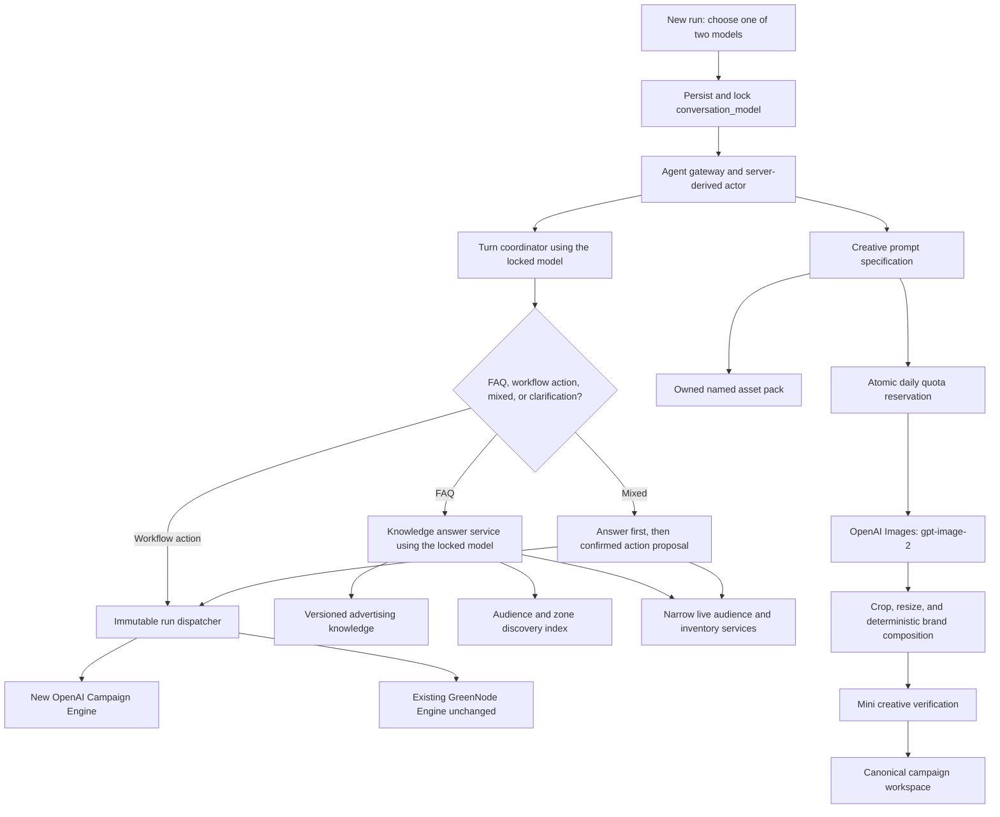

# Advertising Agent — OpenAI Independence, Creative Studio, and Knowledge Roadmap

Date: 2026-07-21

Status: proposed next phase. The architecture and delivery order are implementation-ready. `LDP`, inventory data sources, and video-generation policy remain discovery gates and must not be treated as committed behavior yet.

## 1. Outcome

This phase makes the campaign agent operable without GreenNode, turns AI creative generation into a durable brand-aware product capability, expands the agent from workflow guidance into a grounded advertising assistant, and corrects reach/reporting quality issues before the placement catalog grows.

The target outcomes are:

- Guided Workflow and Campaign Autopilot can complete their supported journeys using only OpenAI services.
- The current GreenNode/MiniMax workflow remains intact and becomes one selectable run engine. A new OpenAI workflow is implemented as a separate sibling component.
- A user selects GreenNode/MiniMax or OpenAI when creating a run. That selection is immutable for the lifetime of the run.
- Image generation is OpenAI `gpt-image-2` for both run-engine choices.
- Every authenticated or anonymous actor has one durable 20-image daily allowance across Guided and Autopilot entry points.
- Creative generation accepts named reference assets and produces editable, format-aware prompt specifications before spending image quota.
- General advertising questions are answered from a versioned knowledge base, while current reach and inventory questions use narrow live service tools rather than direct model/database access.
- Audience reach never exceeds the real addressable universe and is not presented as exact when only marginal segment sizes are available.
- Analytical reports become easier to interpret through better grounding, schema, metric explanations, and evaluated `gpt-5.4-mini` reasoning.
- New ad zones and video are added only after these foundations are measured and stable.

## 2. Verified current baseline

The current release already has anonymous-first account sessions and ownership, Guided and Autopilot campaign flows, audience RAG, creative intelligence, placement-aware generation, reports, Zalo integration, and a 35-placement catalog.

The gaps relevant to this phase are:

| Area | Current state | Consequence |
|---|---|---|
| Main agent LLM | `agent/config.py` and `agent/llm.py` implement the current GreenNode/MiniMax workflow. | Revocation of the GreenNode key blocks that workflow, and there is no independent OpenAI workflow component users can select. |
| OpenAI path | Zalo already uses the official OpenAI Responses API. Reports already default to `gpt-5.4-mini`. | Useful patterns exist, but there is no separate OpenAI campaign-engine component yet. |
| VLM | Creative intelligence uses an OpenAI-compatible endpoint and function-call-shaped JSON. | The provider, model, schema behavior, and failure policy need an explicit OpenAI implementation. |
| Image generation | `agent/handlers/image_gen.py` uses GreenNode, `openai/gpt-image-1`, three proxy ratios, and an in-memory counter of 10 per session. | It is neither provider-independent nor durable, and restarts/new sessions bypass the limit. |
| Creative input | Users choose a format and enter optional free text. There is no named asset pack or structured asset-use instruction. | Logos/products/references cannot be managed predictably across prompt composition and generation. |
| Audience reach | Python and frontend JavaScript separately sum segment sizes with a decaying multiplier. | Selecting many overlapping segments can produce impossible totals such as roughly 300 million. |
| Knowledge | Audience catalog RAG exists, while general FAQ behavior is mostly system-prompt and workflow guidance. | The agent cannot reliably distinguish durable guidance, catalog discovery, and live operational facts. |
| Reports | Six report views and report Q&A exist, with clearly labelled synthetic showcase delivery data. JSON is requested through prompt text and parsed. | A better model helps, but comprehension still needs stronger data contracts, explanations, grounding, and evaluation. |

## 3. Decisions

### 3.1 Two selectable conversational models

The run-creation UI contains exactly two conversational model choices:

| User-facing choice | Immutable run value | Implementation |
|---|---|---|
| GreenNode — MiniMax M2.5 | `greennode_minimax` | The current GreenNode workflow component, preserved as-is. |
| OpenAI — GPT-5.4 mini | `openai_gpt_5_4_mini` | A new, independent OpenAI workflow component using the official OpenAI API. |

`gpt-5.4-mini` is the OpenAI conversational choice. Do not use `gpt-5.4-nano` for hidden intent routing or selected campaign turns, because that would make one run use multiple conversational models and violate the model-lock rule.

At run creation, the server validates and persists:

```json
{
  "conversation_model": "greennode_minimax|openai_gpt_5_4_mini",
  "conversation_model_locked_at": "...",
  "conversation_model_version": "resolved deployment model ID"
}
```

Every conversational turn, including FAQ classification, FAQ answer generation, workflow reasoning, tool selection, brief synthesis, and recovery, uses the persisted model choice. Requests to change it after run creation return a conflict with guidance to start a new run. Deployment configuration cannot silently migrate an existing run to the other component.

Specialist services remain fixed and are not selectable conversational-model switches:

| Specialist service | Fixed model/policy |
|---|---|
| Image generation and reference editing | `gpt-image-2` through the official OpenAI Images API for both run choices. |
| Creative VLM | Start with `gpt-5.4-nano` for cost-controlled structured vision analysis, fail closed on uncertainty, and promote to mini only if the creative evaluation set shows nano is insufficient. |
| Analytical report generation | Keep the existing OpenAI `gpt-5.4-mini` report service. |
| Creative prompt composer | A shared OpenAI `gpt-5.4-mini` specialist service, invoked only after the user requests prompt composition. |

The UI and documentation must distinguish the locked conversational model from these fixed product services so “this run uses GreenNode” never implies that paid image generation also goes through GreenNode.

### 3.2 Separate engine components

Do not refactor, wrap, or replace the internals of the existing GreenNode workflow to create the OpenAI path.

Add a run dispatcher in front of two sibling components:

- `GreenNodeCampaignEngine`: the current GreenNode/MiniMax workflow entry point and behavior, left intact.
- `OpenAICampaignEngine`: a new component with its own official OpenAI client, prompt/system configuration, structured turn decision, tool-call adapter, retry policy, and readiness check.

The components may call the same existing domain services—workspace persistence, audience retrieval, creative services, ownership checks, confirmations, and order creation—but the OpenAI component must not require changes to the GreenNode model client or its prompt execution path.

The dispatcher reads the immutable `conversation_model` from server-side run state; it never accepts the browser's model value as authority after creation. GreenNode readiness and OpenAI readiness are independent. A revoked GreenNode key disables new/continued GreenNode runs with a clear message but does not affect OpenAI runs.

### 3.3 Image quota semantics

Define one quota unit as one image output successfully returned by the provider. A three-format Autopilot generation consumes three units. Prompt previews, format planning, deterministic crops, and failed calls that return no image consume zero units. User rejection of a successfully generated image does not refund a unit because provider cost was incurred.

The product limit is 20 units per actor per Asia/Ho_Chi_Minh calendar day across:

- Guided and Autopilot;
- OpenAI and GreenNode run-engine choices;
- initial generations and reference-image edits.

Authenticated quota keys use the server-derived user ID. Anonymous quota keys use the existing server-issued anonymous identity, never a browser-supplied owner ID. Anonymous enforcement is necessarily best-effort: clearing all local identity can create a new actor. Add rate/abuse controls, but do not claim a perfect per-human limit without login.

When an anonymous actor logs in, link its quota subject to the account for accounting only and use the stricter combined usage for that day. This must not broaden the existing rules for claiming conversations or campaign ownership.

### 3.4 Image size policy

`gpt-image-2` supports flexible dimensions, but not arbitrary placement sizes: each edge must be a multiple of 16, the long-to-short ratio is at most 3:1, and total pixels must remain within the documented range. Several current placements are wider than 3:1, including 1160×250, 2032×528, 2224×480, and 1160×280.

Therefore:

1. Generate directly at a suitable multiple-of-16 proxy when the target is within model constraints.
2. For wider placements, generate a high-resolution 3:1 composition with an explicit crop-safe band, then deterministically crop/resize to the exact catalog dimensions.
3. Prefer generating the visual/background with the model and compositing the original logo, legal text, critical copy, and CTA deterministically. Do not ask the image model to redraw an exact brand logo.
4. Verify exact dimensions, safe-area occupancy, logo presence, OCR/text quality, and brief match after composition.
5. Use low quality for explicitly labelled drafts and medium quality for normal final generation. High quality requires an explicit product/admin policy because 20 high-quality outputs per actor can be materially expensive.

## 4. Target architecture



Core rules: a run never changes its selected conversational model; a FAQ does not mutate workflow state; and models choose among approved capabilities without direct database credentials or arbitrary query execution.

## 5. Delivery roadmap

### NP-0 — Measurement, contracts, and unresolved feedback

Purpose: prevent a model migration from being mistaken for a quality improvement without evidence.

Work:

1. Capture the current GreenNode behavior, latency, token use, failure rate, and Vietnamese output on the existing golden/e2e scenarios while the endpoint is unavailable or from retained evidence where live comparison is impossible.
2. Add evaluation sets for:
   - campaign conversation and tool selection;
   - creative prompt composition and VLM verdicts;
   - static FAQ versus live-data routing;
   - report explanation questions;
   - audience reach invariants.
3. Add per-call telemetry: provider profile, resolved model/snapshot, capability, tokens, latency, retries, error class, run ID, and estimated cost. Exclude prompts, secrets, and user assets from normal logs.
4. Obtain the original `LDP` feedback, screen/context, expected behavior, and owner. Record the result as a scoped requirement. Do not assume it means landing page.
5. Decide which reports remain synthetic showcase data and which can be backed by real delivery data in this phase.

Exit criteria:

- Baseline and pass/fail thresholds are versioned.
- `LDP` is either defined and scheduled or explicitly deferred.
- Cost and quality can be compared by capability rather than only by total API bill.

### NP-1 — Independent OpenAI runtime

Purpose: restore a complete campaign path independent of GreenNode.

Work:

1. Leave the current GreenNode model client and workflow execution path intact.
2. Add the two-option model selector to new Guided conversations and Autopilot runs. Defaulting behavior must be an explicit product/config decision, not an availability-driven silent switch.
   - Show both choices and their readiness status.
   - While the GreenNode key is revoked, show GreenNode as temporarily unavailable rather than removing it.
   - Existing GreenNode runs remain locked and resumable when GreenNode returns; they do not fall through to OpenAI.
3. Persist and lock `conversation_model` at run creation. Existing pre-migration runs retain `greennode_minimax` unless a documented migration rule says otherwise; they are never silently converted to OpenAI.
4. Add a thin server-side `CampaignEngineDispatcher` that reads the locked value and invokes either the existing GreenNode entry point or the new OpenAI component.
5. Implement `OpenAICampaignEngine` with its own official OpenAI client, system prompt, structured turn-decision contract, tool-call adapter, timeouts, retries, and normalized errors. It uses `gpt-5.4-mini` for all conversational turns in that run.
6. Reuse existing domain services and schemas rather than forking campaign data, ownership, approval, or order behavior.
7. Persist engine/model provenance on conversations and runs. Fixed specialist services persist their own separate model provenance on reports, VLM verdicts, prompt specs, and generated assets.
8. Make GreenNode, OpenAI conversational, VLM, reports, and images separate readiness capabilities. GreenNode failure must not make an OpenAI run unready.
9. Add feature flags and kill switches per engine/capability. Secrets remain server-side and independently rotatable.
10. Run unchanged GreenNode workflow regressions plus the full Guided, Autopilot, review/confirm, restart, and Zalo suites for the new OpenAI component.

Exit criteria:

- A fresh anonymous user can complete every supported Guided and Autopilot stage without a GreenNode key.
- Creating a run records exactly one valid model choice; attempts to change it mid-run are rejected.
- Existing GreenNode workflow requests continue through the existing component without internal refactoring or behavior regression.
- Tool schemas, ownership checks, confirmations, and idempotent side effects behave identically in both components.
- Provider errors are user-readable and do not corrupt workspace state.
- OpenAI conversational turns never route secretly to nano or GreenNode.

### NP-2 — Audience unique-reach correction

Purpose: fix the impossible “select all equals 300 million users” result before adding more segments or zones.

The current segment sizes are marginals. Their exact union cannot be derived by summing them, even with a decay multiplier. The correct source is a DMP aggregate/overlap endpoint over the selected segment IDs.

Work:

1. Confirm the addressable user universe and whether a real aggregate unique-reach service exists.
2. Introduce one server endpoint and one canonical result contract:

```json
{
  "selected_segment_ids": ["..."],
  "unique_reach": 4200000,
  "range": {"low": 3600000, "high": 4700000},
  "method": "dmp_union|calibrated_estimate",
  "universe": 52000000,
  "confidence": "high|medium|low",
  "source_updated_at": "..."
}
```

3. If a real union service exists, query it server-side with caching and bounded timeouts.
4. If it does not exist, use a calibrated, universe-capped estimator and return a range—not a fabricated exact unique count. A probabilistic union can be a starting point, but taxonomy correlation/overlap coefficients must be calibrated against sample aggregates.
5. Remove the separate Python/JavaScript total formulas. The frontend renders the server result and labels it “estimated unique reach” when appropriate.
6. Handle stale/unknown segments and unavailable estimates explicitly rather than displaying zero or an inflated fallback.

Required tests:

- result never exceeds the addressable universe;
- selecting the same segment twice does not change reach;
- adding a segment never reduces the base estimate;
- all-segment selection remains within the universe;
- single-segment estimates stay compatible with their catalog range;
- frontend and API display the same value/method;
- cache invalidation follows catalog/data-version changes.

Exit criteria:

- The reported 300-million behavior is reproduced by a test and then eliminated.
- Product copy distinguishes actual unique reach from an estimate.
- The expanded catalog cannot reintroduce uncapped arithmetic.

### NP-3 — `gpt-image-2` creative studio and durable quota

Purpose: replace the current one-text-box generator with a paid, auditable, brand-aware creative flow shared by Guided and Autopilot.

#### A. Quota and job persistence

Add a durable image-generation job and daily quota ledger in MongoDB. An atomic reservation must check `succeeded + reserved + requested <= 20` before calling OpenAI. Finalize the reservation on returned outputs; release it when the provider definitively returns no image. Ambiguous timeouts remain reconcilable and must not automatically trigger a second paid call.

Each job stores:

- server-derived account/anonymous subject and local-day bucket;
- conversation, workspace, run, format-plan, and idempotency IDs;
- provider/model snapshot, requested quality, proxy and target dimensions;
- prompt-spec version/fingerprint, named asset IDs, output count, status, and timestamps;
- provider request/error metadata, without API keys or raw sensitive prompts in logs;
- generated asset provenance and estimated cost.

Expose quota status consistently in both modes. Concurrency, refresh, restart, duplicate clicks, and worker retries must not overspend or double charge quota.

#### B. Named creative assets

Create an owned `creative_asset` contract with:

- immutable asset ID and owner;
- user-visible name;
- kind: `logo`, `product`, `packshot`, `character`, `style_reference`, `background`, or `legal`;
- user instruction describing how it should be used;
- priority/required flag;
- storage URL, MIME type, dimensions, hash, moderation/analysis state, and lifecycle timestamps.

Assets are uploads stored through the existing media/storage boundary, not arbitrary base64 embedded in workspace JSON. Enforce type/size limits, ownership, content scanning, and retention/deletion policy.

#### C. Prompt composer

After the format and assets are selected, `gpt-5.4-mini` produces a schema-validated, editable `CreativePromptSpec` containing:

- campaign objective, audience, promise, CTA, and message hierarchy;
- visual concept, brand colors/tone, required and forbidden content;
- named asset bindings and intended use;
- target placement dimensions, model proxy dimensions, safe areas, and crop/composition plan;
- text/logo policy and deterministic overlay instructions;
- quality, output count, and VLM acceptance criteria;
- prompt template version and input fingerprint.

Generating this prompt costs no image quota. The user can edit and approve it before the paid image call. Treat asset names/descriptions as untrusted input and keep them inside structured fields, not as authority-changing instructions.

#### D. Mode-specific experience

Guided/Copilot Creative step:

1. Choose placements/formats.
2. Upload and name assets; assign type and use.
3. Enter optional visual direction.
4. Generate and edit the prompt specification.
5. See quota/cost-quality information and confirm generation.
6. Review exact-format output and VLM findings before adding it to the workspace.

Autopilot intake:

1. Choose upload, AI generation, or mixed creative source at the beginning.
2. Provide the asset pack and global visual direction before starting.
3. The graph plans minimal required format families, composes prompt specs, and generates within the remaining quota.
4. If quota is insufficient, the run pauses with choices to reduce variants, upload assets, or continue the next day. It does not silently omit required formats.

#### E. Generation and verification

Use the Images API for single generation/edit jobs and multiple reference images. Reserve the Responses image tool for a future conversational edit experience. Generate a visual master/proxy, apply deterministic crop/composition, and then run:

- exact-size and file validation;
- safe-area and focal-subject checks;
- OCR and unexpected-text detection;
- required logo/product presence and reference-fidelity checks;
- current safety and brief-match checks;
- per-placement compatibility and assignment.

Exit criteria:

- Both conversational engine choices generate images through direct OpenAI `gpt-image-2` only.
- The quota survives restarts and cannot be bypassed with a new conversation.
- Concurrent requests cannot exceed 20 outputs for one actor/day.
- A named logo/product reference is preserved measurably better than the current free-text flow.
- Every accepted asset has exact catalog dimensions and full generation/composition provenance.
- Current wide-banner formats pass crop-safe and brand-overlay tests.

### NP-4 — Grounded advertising FAQ and live-data tools

Purpose: let the assistant answer broader advertising questions without turning the model into a database client.

#### A. How the agent decides between FAQ and a user request

Every incoming message passes through a turn coordinator before any workflow mutation. The coordinator uses the run's locked conversational model—MiniMax for a GreenNode run or `gpt-5.4-mini` for an OpenAI run—to return a schema-validated decision:

```json
{
  "turn_type": "faq|workflow_action|mixed|clarification",
  "faq_scope": "static_knowledge|catalog_discovery|live_system|null",
  "workflow_action": "approve|update_brief|select_audience|generate_creative|select_zone|launch|other|null",
  "entities": [{"type": "audience|zone|date_range|campaign|other", "value": "..."}],
  "needs_live_data": false,
  "would_mutate_workspace": false,
  "confidence": 0.0
}
```

Routing precedence is deliberately conservative:

1. Deterministic workflow signals win first: approval buttons/tokens, active-step form submissions, uploads, explicit edit/select/generate/launch verbs, and replies to a pending confirmation are `workflow_action`.
2. A question requesting explanation, recommendation, definition, comparison, current count, or availability—with no requested mutation—is FAQ.
3. A message that asks for information and a change is `mixed`.
4. Low-confidence or missing-entity messages are `clarification`; no workflow state changes.

Behavior by decision:

| Decision | Behavior |
|---|---|
| `faq` | Answer from the appropriate knowledge/live lane, preserve the current workflow step and workspace revision, and show sources/freshness. |
| `workflow_action` | Dispatch unchanged to the run's selected campaign engine. Existing GreenNode workflow actions continue through the existing GreenNode component. |
| `mixed` | Perform read-only retrieval first, answer the question, then show the proposed mutation and require the normal confirmation before dispatching it to the selected engine. |
| `clarification` | Ask one focused question and make no state change. |

Examples:

| User message | Decision | Result |
|---|---|---|
| “What is a frequency cap?” | FAQ — static knowledge | Explain it with a reviewed knowledge source; campaign state is untouched. |
| “Which audiences are related to skincare?” | FAQ — catalog discovery | Retrieve and explain catalog candidates; do not select them. |
| “How many unique users do those audiences currently cover?” | FAQ — live system | Resolve the referenced IDs, call the canonical reach service, and return method/freshness. |
| “Is ZNews Top Banner free next week?” | FAQ — live system | Call zone availability; do not select the zone. |
| “Select ZNews Top Banner.” | Workflow action | Send the action to the locked run engine and follow the existing proposal/confirmation rules. |
| “Is ZNews Top Banner free next week? If yes, select it.” | Mixed | Check availability, explain the result, propose selection, and wait for confirmation before mutation. |
| “Yes” while a zone-selection confirmation is pending | Workflow action | Resolve against pending confirmation rather than misclassifying it as general chat. |

The coordinator must not become a third conversational model. It runs with the same immutable model chosen for the run. To protect the existing GreenNode flow, only high-confidence FAQ/mixed messages are intercepted; all recognized workflow actions are passed to the current GreenNode entry point unchanged.

#### B. Knowledge and data lanes

Use three knowledge lanes:

| Question type | Source | Example |
|---|---|---|
| Durable advertising guidance | Versioned curated knowledge base | “What is a good awareness campaign setup?” |
| Catalog discovery and definitions | Generated audience/zone catalog snapshot indexed for retrieval | “Which audiences relate to home renovation?” |
| Current operational fact | Narrow live service tool | “How many users are in those audiences now?” or “Is zone A available during range B?” |

Work:

1. Create source-controlled knowledge documents with metadata: title, topic, applicable market/product, owner, reviewed date, expiry/review date, and source.
2. Cover objectives, buying/setup guidelines, audience concepts, overlap/reach caveats, zone and format definitions, KPI selection, budget/flight guidance, creative best practices, reporting interpretation, and product limitations.
3. Publish catalog snapshots separately from prose guidance. Stable names/descriptions can be indexed; volatile counts and inventory must not be frozen into answers.
4. Implement the structured turn coordinator with the run's locked model. Add deterministic active-step/pending-confirmation guards before the model decision and confidence thresholds before FAQ interception.
5. Add allowlisted tools such as:
   - `search_ad_knowledge`;
   - `search_audience_catalog`;
   - `get_audience_reach`;
   - `get_zone_details`;
   - `get_zone_availability`;
   - `compare_zones`.
6. Implement tools through backend domain services/repositories with validated inputs, ownership where applicable, timeouts, caching, and audit logs. Never expose raw Mongo/Qdrant access or arbitrary query syntax to the model.
7. Render answer citations/source dates. Say when knowledge may be stale or a live service is unavailable.
8. Record `turn_type`, route, confidence, tools used, whether state changed, and run model for evaluation without logging sensitive message contents by default.

Routing examples:

- “What audience covers topic A?” retrieves candidate catalog IDs and explains them; no live DB count is needed.
- “What is the total current audience related to topic A?” first retrieves candidate IDs, then calls the canonical unique-reach service from NP-2.
- “Is zone A free from B to C?” always calls the inventory service with the requested date range.

Exit criteria:

- FAQ evals meet correctness/source thresholds in Vietnamese and English.
- The FAQ/action confusion test set has zero unintended workspace mutations.
- Existing GreenNode workflow-action regression cases still enter the unchanged GreenNode component.
- Static guidance includes citations and never invents live availability/counts.
- Dynamic questions call only the required service tools and preserve date/source context.
- Prompt injection inside retrieved documents or asset descriptions cannot grant new tools or bypass ownership.

### NP-5 — Report comprehension and feedback closeout

Purpose: improve how users understand reports rather than only swapping the model.

Work:

1. Keep the existing fixed `gpt-5.4-mini` report service. Report-question routing inside the campaign conversation uses the run's locked conversational model; it does not introduce nano into an OpenAI or GreenNode conversation.
2. Replace prompt-only JSON with a validated structured output contract and explicit per-report metric definitions.
3. Provide the model a compact data glossary, formula/source metadata, comparison period, campaign goal, and known data limitations.
4. Require each finding to include supporting metric IDs/values, timeframe, interpretation, confidence, and a bounded recommendation.
5. Improve Q&A retrieval over the current report so answers cite report sections/numbers and say “not available” when the data does not support a conclusion.
6. Preserve the visible synthetic-showcase label. A smarter model must not make simulated delivery data sound live.
7. Build a report comprehension eval set from real feedback: summary accuracy, anomaly explanation, causal overclaiming, actionable recommendation, Vietnamese readability, and metric traceability.
8. Implement the clarified `LDP` item only after NP-0 assigns a concrete meaning and acceptance criteria.

Exit criteria:

- Every headline finding is traceable to supplied report data.
- Unsupported causality and invented metrics fail automated evaluation.
- Target users can answer the selected comprehension questions from the generated report in acceptance testing.
- Audience feedback is closed by NP-2 and `LDP` is closed or explicitly deferred with owner/reason.

### NP-6 — Placement catalog expansion

Purpose: enrich the demo only after reach, knowledge, and creative capability contracts are stable.

Work:

1. Define a versioned placement schema with channel/property, device, media types, exact dimensions, safe areas, duration/file/codec limits, pricing unit, inventory source, active dates, and provenance.
2. Validate new zones against an authoritative source or label them clearly as demo fixtures. Do not mix invented inventory/pricing with live-looking data.
3. Generate catalog knowledge snapshots for discovery and integrate live availability through the NP-4 service boundary.
4. Add compatibility tests ensuring format plans, deterministic composition, VLM checks, forecasting, and order creation support each new placement.
5. Version/deactivate placements rather than mutating historical campaign meaning.

Exit criteria:

- Every new zone has valid capability/provenance metadata and test coverage.
- Existing campaigns remain reproducible against their catalog version.
- Adding a placement does not require hardcoded frontend image logic.

### NP-7 — Video format and generation

Purpose: add video as a separate media pipeline after image foundations are proven.

Do not fold video into NP-3 by changing only `media_type`. First run a discovery/spike covering:

- target placements, aspect ratios, durations, codecs, file-size limits, audio/caption policy, and moderation;
- provider/model choice and current pricing/availability at implementation time;
- asynchronous job duration, cancellation, retry/idempotency, storage, transcoding, thumbnails, and preview;
- video-specific prompt/reference inputs and review checkpoints;
- video creative intelligence: duration, frames, OCR/captions, logo visibility, audio, safety, and placement compatibility;
- a separate cost/quota policy; the image 20/day allowance must not be reused implicitly.

Only after the spike is accepted should implementation add video asset contracts, workers, UI review, Autopilot pauses, and order payload support.

## 6. Cross-cutting contracts and safety

### Ownership

- Resolve all user/anonymous actors server-side.
- Enforce ownership on uploaded references, generated assets, quota jobs, workspaces, and reports.
- Login linkage for quota must remain separate from conversation/campaign claim rules.

### Idempotency and paid side effects

- Prompt composition is reproducible by input fingerprint.
- Image reservation and generation have one durable idempotency key.
- A retry after a returned image reuses the persisted asset.
- An ambiguous provider timeout is reconciled or presented for manual retry; it is not blindly repeated.

### Data and privacy

- Document retention and deletion for uploaded brand/product assets and generated outputs.
- Do not log API keys, base64 media, raw personal data, or full prompts by default.
- Mark sources and freshness for knowledge, reach, inventory, and reports.
- Keep provider data-classification/fallback policy explicit; do not silently send data to a second provider.

### Cost controls

The 20-output quota is necessary but not sufficient. Add:

- per-model/quality estimated cost telemetry;
- global daily/monthly budget alerts and a generation kill switch;
- medium quality as the normal final default;
- bounded variants and reference images;
- no automatic high-quality regeneration loop;
- cache/reuse of identical approved prompt-spec plus format results where product policy permits.

## 7. Release strategy

Use progressive flags:

1. `openai_gpt_5_4_mini` in internal/staging with shadow evaluation where GreenNode evidence is available.
2. OpenAI-only Guided, then OpenAI-only Autopilot.
3. Durable quota in observe mode, then enforce 20/day before enabling `gpt-image-2` broadly.
4. Creative Studio for internal users, then a small production cohort, then all users.
5. FAQ static knowledge first; dynamic audience and inventory tools only after their service contracts pass truth tests.
6. Report improvements and feedback acceptance.
7. Catalog expansion.
8. Separately approved video experiment.

Rollback boundaries must disable one capability without rolling back account sessions, conversations, campaign ownership, or existing assets.

## 8. Recommended implementation order

| Order | Milestone | Relative effort | Dependency |
|---:|---|---|---|
| 1 | NP-0 measurement and `LDP` discovery | Small | None |
| 2 | NP-1 OpenAI-native runtime | Large | NP-0 eval baseline |
| 3 | NP-2 audience reach correction | Medium | Addressable-universe/data-source decision |
| 4 | NP-3 durable quota and `gpt-image-2` Creative Studio | Large | NP-1, identity/ownership baseline |
| 5 | NP-4 grounded FAQ and live tools | Large | NP-2 reach API; inventory service contract |
| 6 | NP-5 report comprehension/feedback closeout | Medium | NP-0 report eval; can overlap late NP-4 |
| 7 | NP-6 placement expansion | Medium | NP-2, NP-3, NP-4 |
| 8 | NP-7 video discovery then implementation | Extra large | NP-3 and NP-6 stable |

The first implementation slice should be NP-0 plus NP-1. It adds an independent OpenAI choice without altering the current GreenNode workflow, and creates the immutable run dispatch, telemetry, structured turn decision, and evaluation foundation used by every later item. The audience bug can proceed as a bounded parallel correctness slice once its data source/universe is confirmed.

## 9. Product decisions to confirm before their milestone

The roadmap recommends defaults, but these need explicit product confirmation before release:

1. One successful output equals one of the 20 daily image units, including each output in an Autopilot batch.
2. A run offers GreenNode/MiniMax and OpenAI/GPT-5.4-mini at creation and rejects every mid-run model-change request.
3. GreenNode remains visible as temporarily unavailable while its readiness check fails; existing GreenNode runs wait rather than switching models.
4. The quota day rolls over in Asia/Ho_Chi_Minh time.
5. Normal final images use medium quality; high quality is admin/explicit only.
6. Anonymous limits are described as per anonymous identity, not guaranteed per person.
7. Exact audience reach requires DMP aggregate data; otherwise the UI shows a range and method/confidence.
8. The meaning and acceptance criteria of `LDP` come from the original feedback owner.
9. Video receives a separate quota/budget decision after its provider spike.

## 10. Definition of phase complete

This phase is complete when:

- the production campaign journeys are independently operable through the new OpenAI component;
- the existing GreenNode workflow remains intact, separately selectable, and resumable when its key returns;
- each run has one immutable conversational model and never falls through to the other model;
- the daily image quota is durable, actor-based, concurrency-safe, and shared across modes;
- users can supply named brand assets and approve an auto-composed format-specific prompt before generation;
- exact-format outputs pass reference, crop, text, and safety checks;
- audience totals are canonical, universe-capped, and honestly labelled;
- FAQ answers route correctly among versioned knowledge, catalog discovery, and live services with citations/freshness;
- report findings are schema-valid, traceable, understandable, and evaluated;
- all user feedback is closed, clarified, or explicitly deferred;
- new placements are versioned and tested; and
- video work begins only from an accepted specification and cost/safety policy.

## 11. OpenAI references used for this plan

These capabilities and constraints were checked against the official documentation on 2026-07-21 and should be rechecked when implementation starts because model availability and pricing can change:

- [`gpt-5.4-mini`](https://developers.openai.com/api/docs/models/gpt-5.4-mini)
- [`gpt-5.4-nano`](https://developers.openai.com/api/docs/models/gpt-5.4-nano)
- [`gpt-image-2`](https://developers.openai.com/api/docs/models/gpt-image-2)
- [Image output size, quality, and format constraints](https://developers.openai.com/api/docs/guides/image-generation#customize-image-output)
- [Reference-image editing](https://developers.openai.com/api/docs/guides/image-generation#edit-images)
- [Image generation cost calculation](https://developers.openai.com/api/docs/guides/image-generation#calculating-costs)
