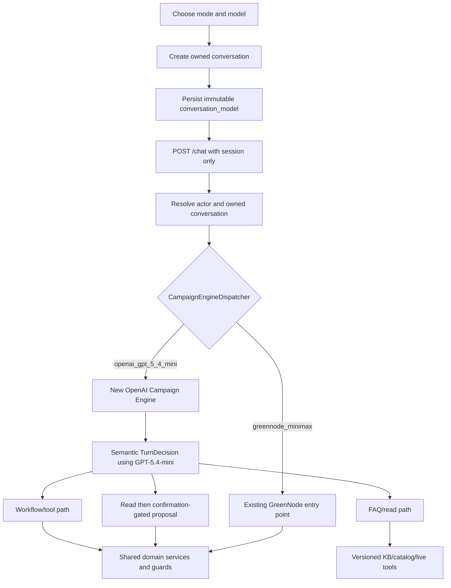

# OpenAI Engine and Semantic FAQ — Technical Implementation Plan

Date: 2026-07-21

Status: campaign-engine implementation complete. Slices 1–4 are implemented, regression-tested, deployed, and production-verified: immutable conversation model identity, server dispatch, model catalog/UI selection, semantic TurnDecision planning, the independent OpenAI Responses answer/tool loop, durable proposal handling, independent OpenAI Guided specialists, and immutable Autopilot model propagation are live. GreenNode remains an unchanged sibling component. The OpenAI option is available; production currently marks GreenNode temporarily unavailable only because its provider key has been revoked.

## 1. Non-negotiable behavior

1. A new campaign conversation selects exactly one conversational engine:
   - `greennode_minimax`
   - `openai_gpt_5_4_mini`
2. The server stores that choice before the first turn. Browser payloads cannot change it later.
3. A conversation and every Autopilot run created from it use that same conversational engine for all conversational/reasoning calls.
4. Existing GreenNode model-client and workflow internals are not refactored to create the OpenAI implementation.
5. OpenAI is a sibling component with its own client, prompts, structured turn decision, tool loop, retry/readiness behavior, and telemetry.
6. Normal language is understood semantically by the selected model. String matching is not the primary FAQ/action classifier.
7. Deterministic code is reserved for trusted protocol metadata, authorization, validation, state-transition rules, confirmations, idempotency, and paid side effects.
8. Fixed specialist services are separate from the conversational choice:
   - image generation: `gpt-image-2`;
   - creative VLM: initially `gpt-5.4-nano`, evaluation-gated;
   - reports: existing `gpt-5.4-mini` service;
   - creative prompt composition: fixed OpenAI `gpt-5.4-mini` service.

## 2. Current code map and gaps

| Concern | Current entry point | Required change |
|---|---|---|
| Conversation creation | `agent/router.py` → `identity.create_conversation` | Accept, validate, persist, and return immutable `conversation_model`. |
| Browser creation | `agent_frontend/src/api/agentApi.js` and `useChat.js` | Send the selected model only during conversation creation. |
| Homepage selection | `ExperienceSelector.jsx` → `App.startCampaign` | Add two-model selection independent of Guided/Autopilot mode. |
| Chat routing | `agent/router.py::chat` | Resolve the owned conversation, read its stored model, and dispatch free-form reasoning. Do not trust a model field in `ChatRequest`. |
| GreenNode free-form | `handlers/freeform.py` or LangGraph flag path | Keep as the GreenNode campaign-engine entry point. |
| GreenNode client | `agent/llm.py` | Keep unchanged during the additive OpenAI engine work. |
| OpenAI implementation | Does not exist for the web campaign engine | Add `agent/openai_campaign/` with independent Responses API client and engine. |
| Brief/audience/RAG reasoning | Direct imports of `llm.simple_generate` | Add engine-aware sibling implementations or a run-scoped call boundary; never silently fall back to GreenNode. |
| LangGraph structured generation | `graph/structured.py` imports GreenNode client | Add an OpenAI-specific structured implementation; do not mutate the GreenNode implementation. |
| Autopilot run | `autopilot.service.create_run` | Copy immutable `conversation_model` from the owned conversation into the run. |
| Autopilot chat | `autopilot/chat.py` imports GreenNode generator | Dispatch using the run/conversation model. |
| Semantic FAQ | General free-form prompt and existing tool registry | Add typed turn decision, versioned knowledge retrieval, and narrow live tools. |

## 3. Data contracts

### 3.1 Conversation

Add these fields to `agent_conversations`:

```json
{
  "conversation_model": "greennode_minimax|openai_gpt_5_4_mini",
  "conversation_model_locked_at": "UTC datetime",
  "conversation_model_version": "configured model ID at creation"
}
```

Rules:

- `conversation_model` is required for new browser-created conversations.
- Internal legacy callers may omit it during migration and receive `greennode_minimax` explicitly in stored state.
- Reads expose the model choice but never credentials/configuration.
- No generic update endpoint can change these fields.
- Starting a new campaign is the only way to choose a different model.

### 3.2 Autopilot run

Copy into `agent_runs`:

```json
{
  "conversation_model": "openai_gpt_5_4_mini",
  "conversation_model_version": "gpt-5.4-mini",
  "conversation_id": "conv_..."
}
```

The worker reads this persisted value. It must not look at a current environment default when retrying or resuming a task.

### 3.3 Model catalog API

Add `GET /api/agent/conversation-models`:

```json
{
  "models": [
    {
      "id": "greennode_minimax",
      "label": "GreenNode — MiniMax M2.5",
      "available": false,
      "status": "temporarily_unavailable",
      "reason": "provider_disabled"
    },
    {
      "id": "openai_gpt_5_4_mini",
      "label": "OpenAI — GPT-5.4 mini",
      "available": true,
      "status": "available"
    }
  ],
  "default_model": "openai_gpt_5_4_mini"
}
```

Availability is controlled by explicit server configuration/readiness, not browser logic. The key itself is never returned. A model that is unavailable remains visible.

### 3.4 Turn decision

The selected conversational model returns:

```json
{
  "turn_type": "faq|workflow_action|mixed|clarification",
  "user_goal": "concise semantic goal",
  "subrequests": [
    {
      "kind": "question|read|mutation",
      "description": "...",
      "requires_live_data": false,
      "requested_capability": "..."
    }
  ],
  "faq_scope": "static_knowledge|catalog_discovery|live_system|null",
  "workflow_action": "approve|update_brief|select_audience|generate_creative|select_zone|launch|other|null",
  "entities": [],
  "would_mutate_workspace": false,
  "needs_clarification": false,
  "clarification_question": "",
  "confidence": 0.0
}
```

The model receives the message, bounded conversation history, active step, canonical workspace summary, pending confirmation/proposal, allowed capabilities, and knowledge/tool descriptions. It does not receive ownership authority or raw database access.

## 4. Component architecture



`CampaignEngineDispatcher` is intentionally small. It reads a server-owned enum and imports one engine entry point. It contains no prompts, retries, provider fallback, or model credentials.

## 5. Semantic FAQ/action approach

### 5.1 What is semantic

GPT-5.4-mini—not keyword lists—determines:

- whether the user is asking for knowledge, requesting an action, or combining both;
- implied references such as “those audiences”, “the second zone”, or “do that”;
- Vietnamese without accents, typos, indirect phrasing, and multi-intent messages;
- whether current data is required;
- which capability or clarification is needed.

### 5.2 What remains deterministic

Only trusted protocol/state facts bypass semantic classification:

- a UI event with an allowlisted action ID;
- a server-issued pending proposal/confirmation ID;
- a completed upload event;
- ownership and authorization;
- state-transition legality;
- schema validation;
- explicit confirmation before mutation/launch;
- idempotency and quota reservation.

The text `yes`, `ok`, `select`, `what`, or Vietnamese equivalents is never sufficient by itself.

### 5.3 Decision execution

- `faq`: answer without changing workspace revision/current step.
- `workflow_action`: pass semantic action/tool intent to the selected engine and existing guards.
- `mixed`: perform read-only retrieval, answer, construct a normal proposal, and wait for confirmation.
- `clarification`: ask one focused question; perform no tools with side effects.
- Low confidence never produces a mutation.

### 5.4 Model/tool loop

For the OpenAI engine:

1. Produce a schema-validated `TurnDecision` using Responses structured output.
2. Apply policy validation to the decision.
3. Build the answer/tool turn with the same `gpt-5.4-mini` model.
4. Run a bounded function-calling loop over allowlisted tools.
5. Persist the user message, answer, decision metadata, model, tools, and whether state changed.

This uses two calls in the first implementation for observability and correctness. After evaluation, a single-call mandatory decision-tool pattern may be tested for latency/cost, but only if it preserves the typed decision evidence.

## 6. OpenAI campaign engine

Create:

```text
agent/openai_campaign/
  __init__.py
  client.py          # AsyncOpenAI Responses client, retry/timeout/readiness
  schemas.py         # TurnDecision and subrequest schemas
  decision.py        # semantic turn planning
  engine.py          # bounded tool/answer loop and AgentResponse adapter
  prompts.py         # OpenAI-specific instructions
  tools.py           # Responses tool-schema adapter and safe executor
  telemetry.py       # model/cost/latency/route events
```

Implementation requirements:

- Use `OPENAI_API_KEY`; never GreenNode base URL or key.
- Default model `gpt-5.4-mini`, with a pinned configurable model ID.
- `store=false` and a hashed safety identifier.
- Bounded history, tool rounds, tool calls, output tokens, and request timeout.
- Convert existing Chat Completions tool schemas into Responses function tools without changing the GreenNode registry format.
- Reuse domain services and proposal creation; do not call GreenNode helpers that make model requests.
- Normalize provider errors to `AgentResponse` without corrupting state.
- Do not cross-fallback to GreenNode.

## 7. Detailed delivery slices

### Slice 1 — Immutable model identity and dispatcher foundation

Implementation status (2026-07-21): complete locally and regression-tested. The selector shows unavailable engines without removing them; OpenAI is deliberately reported `coming_soon` while its full engine is incomplete.

Files:

- `agent/campaign_models.py`
- `agent/identity.py`
- `agent/router.py`
- `agent/config.py`
- `agent/campaign_engines/dispatcher.py`
- frontend API, App, and ExperienceSelector
- backend/frontend focused tests

Deliver:

- model enum/catalog and explicit availability flags;
- additive conversation fields and migration defaults;
- two-option selector before campaign creation;
- model badges in history/resume context;
- immutable server dispatch;
- unavailable GreenNode remains visible;
- OpenAI selection is enabled only when its campaign engine readiness is true.

### Slice 2 — OpenAI Guided free-form engine

Implementation status (2026-07-21): complete and regression-tested behind the
full-engine readiness gate. The OpenAI option remains `coming_soon` while the
remaining Guided specialist calls and Autopilot workers are not model-pure.

- Add independent Responses client.
- Implement TurnDecision and semantic routing.
- Implement text/tool loop and proposal flow.
- Preserve current form submission handlers initially only when they are deterministic/no-LLM.
- Add OpenAI-specific brief/audience handlers before enabling those steps, because current versions call GreenNode.
- Pass Guided regression and semantic-routing evaluation.

### Slice 3 — Complete Guided model purity

Implementation status (2026-07-21): complete, deployed, and model-purity tested.

- Inventory every direct `llm` import.
- Keep the existing GreenNode handlers unchanged and add OpenAI sibling generation for brief validation, audience selection, RAG query/recommendation, and LangGraph structured output.
- Route every model-backed Guided entry point explicitly from the immutable conversation model; deterministic shared services stay provider-neutral.
- Attach model provenance to every call/artifact.
- Add a test that fails if an OpenAI conversation reaches the GreenNode client.

### Slice 4 — Autopilot model propagation

Implementation status (2026-07-21): complete, deployed, and production-verified as build `2026-07-21.4`. OpenAI Autopilot audience and completed-run Q&A use OpenAI-owned siblings, retries keep the run's persisted model, legacy runs backfill once from their owning conversation, and Zalo-created runs use an explicit channel policy.

- Copy conversation model into `agent_runs`.
- Make worker capability context include the run model.
- Replace direct GreenNode generation in Autopilot chat/audience paths with engine-specific siblings.
- Resume/retry always uses persisted run model.
- Zalo-created runs receive an explicit model choice according to a separate channel policy; they never inherit a mutable global default.

### Slice 5 — Knowledge base and FAQ tools

- Add versioned knowledge document schema and source metadata.
- Build static knowledge and catalog retrieval indexes.
- Add `search_ad_knowledge`, `search_audience_catalog`, `get_audience_reach`, `get_zone_details`, `get_zone_availability`, and `compare_zones`.
- Implement live tools through service boundaries, not raw DB access.
- Render citations/freshness and log route evidence.

### Slice 6 — Image/VLM/report specialist integration

- Implement durable image quota/jobs and `gpt-image-2` Creative Studio per roadmap 45.
- Add fixed `gpt-5.4-nano` VLM with evaluation/fail-closed behavior.
- Keep report generation in its existing fixed OpenAI service while improving schema/grounding.
- Show specialist provenance separately from conversation model.

## 8. Migration

1. New schema is additive; no existing fields are deleted.
2. Existing conversations with no `conversation_model` resolve and are lazily/backfill stored as `greennode_minimax`.
3. Existing Autopilot runs with no model use the model on their owning conversation; if both are absent, resolve to the explicit legacy GreenNode value and persist it before another task is claimed.
4. No existing run is migrated to OpenAI because GreenNode is unavailable.
5. Add indexes only if query plans require them; model choice is normally read through conversation/session identity rather than searched globally.

## 9. Tests

### Persistence and security

- valid choices persist for anonymous and account owners;
- invalid/missing browser choice behavior matches the migration contract;
- public reads return the choice without secrets;
- no update/preferences/chat payload can change it;
- foreign actors cannot discover or change it;
- claim/archive/delete/resume preserve it.

### Dispatch purity

- GreenNode choice calls only the existing GreenNode entry point;
- OpenAI choice calls only `OpenAICampaignEngine`;
- OpenAI provider failure never invokes GreenNode;
- GreenNode failure never invokes OpenAI;
- missing legacy value resolves explicitly to GreenNode;
- resuming after configuration changes uses the stored choice.

### Semantic routing

Use Vietnamese/English paraphrase sets for:

- FAQ without mutation;
- indirect workflow actions;
- contextual `yes/no`;
- mixed read-and-change requests;
- pronouns and earlier entity references;
- multiple questions plus one action;
- low-confidence ambiguity;
- adversarial text asking the model to bypass confirmation.

Require zero unintended mutations in the routing set.

### Frontend

- model selection is required before opening either mode;
- unavailable GreenNode is visible and disabled;
- create payload sends the chosen model once;
- resume displays the stored model and offers no switch;
- “new campaign” allows a fresh choice;
- mobile and desktop selector layouts remain usable.

## 10. Telemetry and acceptance

Log per conversational turn:

- conversation/run ID, engine ID, resolved model ID;
- `turn_type`, confidence, requested capability;
- tools called, state mutation boolean, workspace revision before/after;
- latency, input/output tokens, retry count, normalized error;
- no raw API key, media, or full sensitive prompt.

Slices 1–4 have met the campaign-engine acceptance gate: model choice is immutable, both Guided and Autopilot dispatch are model-purity tested, and OpenAI provider failures cannot cross-fallback to GreenNode.

The initial production rollout is:

1. deploy schema/catalog with both options hidden from users;
2. verify legacy GreenNode regression;
3. enable OpenAI for internal accounts;
4. run Guided evaluation and model-purity checks;
5. enable Autopilot only after run propagation and worker retry tests;
6. expose both choices broadly, with GreenNode readiness shown independently.
