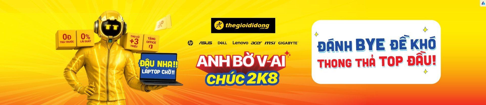

# Znews Replicate - Ads Setup & Integration Documentation

This directory contains a high-fidelity replica of the **Znews (znews.vn)** homepage, tailored for campaign ad setup, testing, and integration during the hackathon. 

The primary goal of this replica is to serve as a testing ground for injecting custom display campaigns through a simulated/live Ad Server API, ensuring 100% layout similarity, accurate ad placements, and zero dependency on live data APIs.

---

## 📂 Directory Structure & Key Files

| File Name | Path | Description |
| :--- | :--- | :--- |
| **`index.html`** | [`index.html`](index.html) | The core structure of the homepage, parsed from the live site. All assets (styles, logos, fonts, images) use absolute CDN paths. Third-party trackers and Google Publisher scripts have been removed to avoid layout overrides. |
| **`style.css`** | [`style.css`](style.css) | Custom overrides and styling rules for our ad banner containers. Defines aspect ratios, responsive scaling, borders, loading states (spinners), and force-hides unwanted blocks (e.g. TV360 banner). |
| **`app.js`** | [`app.js`](app.js) | Orchestrates the UI updates. Lazily loads the inline ad when scrolled into view, initializes ad containers, and populates static widgets (World Cup schedule flags, SJC gold rates, exchange rates, and stock indices) to run offline without live API dependence. |
| **`api.js`** | [`api.js`](api.js) | The ad client integration library. Includes mock fallback databases matching campaign briefs and standardizes Axios/fetch templates for connecting to the ad server. |
| **`ad-pic/`** | `ad-pic/` | Folder containing high-quality ad assets provided for testing campaign placements. |

---

## 🎯 Ad Zone Positions & Targets

We have defined four active campaign banner slots inside `style.css` and `app.js` mapping to original container selectors:

### 1. Top Masthead Banner (`#ZingNews_Masthead`)
* **Placement:** Positioned at the very top of the page (below the navigation bar).
* **Creative Aspect Ratio:** `2485 / 220` (fits `top-banner.jpg` full-bleed/skin background banner).
* **Campaign Target:** Mazda CX-5 Campaign.

### 2. Sidebar Halfpage Banner (`#ZingNews_Halfpage`)
* **Placement:** Top right widget in the sidebar, directly above the "Đọc nhiều" section.
* **Creative Aspect Ratio:** `373 / 742` (fits `side-banner.jpg` in portrait).
* **Campaign Target:** FlyDragon Airlines Campaign.

### 3. Sidebar Bottom Banner (`#ZingNews_PrBox_2`)
* **Placement:** Bottom right widget in the sidebar (immediately under the Halfpage banner).
* **Creative Aspect Ratio:** `373 / 742` (fits `side-banner.jpg` in portrait).
* **Campaign Target:** NeoCard Finance Campaign.

### 4. Inline Middle Banner (`#ZingNews_Masthead_Inline_1`)
* **Placement:** Placed in the middle column after scrolling down through the main news grid.
* **Creative Aspect Ratio:** `1695 / 432` (fits `middle-banner.jpg` VinFast creative).
* **Campaign Target:** VinFast VF 3 Campaign.

> [!NOTE]
> Unused ad containers in the HTML structure (such as `#ZingNews_PrBox_1` and `#ZingNews_R3`) are hidden automatically via CSS rules to prevent them from causing unnecessary margins or layout shifting.

---

## ⚡ Integration Boilerplate (How the Ad Server works)

In `api.js`, we make an Axios request to check if a specific campaign is active for the current site and zone:

```javascript
// Request configuration
const AD_SERVER_CONFIG = {
    baseURL: 'http://localhost:8080/api',
    timeout: 3000,
    siteInfo: 'znews.vn'
};

// Axios API check template
async function fetchAdForZone(zoneId) {
    const params = {
        zoneId: zoneId,
        site: AD_SERVER_CONFIG.siteInfo,
        t: Date.now() // Cache-buster
    };
    
    // In your actual integration, uncomment the API request below:
    /*
    const response = await adApiClient.get('/ads/check', { params });
    if (response.data && response.data.hasAd) {
        return response.data;
    }
    */
}
```

### 🔁 Offline Failover & Hackathon Testing
To make local developer iteration fast and reliable, `fetchAdForZone` automatically falls back to a mock campaign response if the Axios endpoint is offline:
```javascript
// Local campaign mock returned as backup
return {
    hasAd: true,
    campaignId: 'ORD-2026-001',
    brand: 'Mazda CX-5',
    targetUrl: 'https://mazda.com.vn',
    html: `
        <a href="https://mazda.com.vn" target="_blank" style="display: block; width: 100%; height: 100%;">
            
        </a>
    `
};
```

---

## 🛠️ Static Widgets Configured Offline

To prevent network blocks and broken images, several key components have been populated with mock data:
1. **Lịch thi đấu (Schedule)**: World Cup 2026 matches populated using static flags hosted on the high-speed SVG repository `flagcdn.com`.
2. **Kinh doanh (Market Rates)**: SJC Gold (`149.200.000` / `153.200.000`), exchange rates (USD / EUR), and Vietnamese stock indexes (VNINDEX, HNX, UPCOM) populated with colored indicator arrows matching the live styling.
